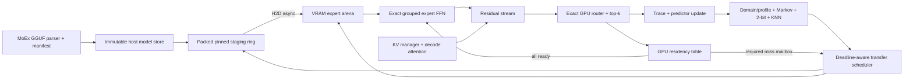

# MoEx Unified Design — Exact Expert Paging for Maximum Decode Throughput

**Date:** 2026-07-15  
**Primary objective:** maximize **measured decode tokens/second** for Qwen3-30B-A3B Q4_K_M on the target 6 GB RTX 4050-class Windows laptop without changing model semantics.  
**Implementation rule:** native Windows 11, MSVC, CMake, CUDA runtime, and MoEx-owned C++/CUDA only. **No llama.cpp/ggml source, headers, kernels, links, callbacks, or runtime.** Algorithms and public file-format behavior may be studied; implementation and tests are MoEx.

---

## 1. Executive decision

MoEx is not a generic LLM runtime. It is a **single-model, exact-execution MoE offload engine**. Its proposed engineering focus is a memory hierarchy that pages **individual Qwen expert weight bundles** between host RAM and VRAM, with prediction used only to start transfers early.

The project wins only if it removes the copy path from the decode critical path often enough to beat reactive expert loading. The main work is therefore:

1. make the full Qwen3 mathematical path correct;
2. make the required-expert fast path entirely GPU-resident;
3. make host-to-device transfer overlap deterministic, deadline-aware, and measurable;
4. use prediction only where it has positive measured value per PCIe byte; and
5. optimize single-token decode kernels, where batch-one GEMV bandwidth and launch overhead dominate.

The previous `~30`, `~60`, and `~90 tok/s` figures are **hypotheses**, not project facts. MoEx may publish a number only after the benchmark protocol in §13 passes on the target machine.

### Hard invariants

1. **The live router is the sole execution authority.** For every token and every MoE layer, MoEx computes the model-defined router output, including activation, top-k, normalization, ordering, and weights.
2. **Execute all and only the routed experts.** `executed ExpertKey set == RouterOutput.ids` for every MoE invocation. Accumulation uses the corresponding live router weights.
3. **Predictors never execute a model decision.** Domain profiles, Markov tables, 2-bit counters, KNN, and dual-load only create speculative DMA requests.
4. **Required miss means stall.** MoEx waits until the exact expert bytes are event-ready. It never substitutes a neighbor, predicted expert, different quantization, or CPU approximation.
5. **Model routing is immutable.** The budget controller may alter cache partitions and prefetch breadth only. It MUST NOT alter top-k, expert count, routing thresholds, router activation, or mixture weights.
6. **Canonical representation is immutable.** The baseline executes the GGUF representation directly. A different hot representation is a separately measured experiment, not a transparent cache optimization.

---

## 2. Model facts and feasibility constraints

The official Qwen configuration describes Qwen3-30B-A3B as 48 layers, 128 experts per MoE layer, 8 activated experts per token, 32 query heads, 4 KV heads, hidden size 2048, `head_dim=128`, and MoE intermediate size 768 [Qwen model card and config](https://huggingface.co/Qwen/Qwen3-30B-A3B). The selected Q4_K_M GGUF file is listed as 18.63 GB decimal, approximately 17.35 GiB [bartowski model card](https://huggingface.co/bartowski/Qwen_Qwen3-30B-A3B-GGUF).

Those facts imply the following planning constraints:

| Constraint | Derived consequence |
|---|---|
| `48 × 8 = 384` routed expert selections per generated token | Every token creates 384 **layer-scoped** demands. `layer 2/expert 7` and `layer 9/expert 7` are different weight objects. |
| A dense FP16 expert contains three `2048 × 768` matrices | Ignoring metadata, one complete FP16 expert is `3 × 2048 × 768 × 2 = 9 MiB`. A 1.65 GiB cache holds roughly 187 such objects before fragmentation, not hundreds of 3 MiB quantized objects. |
| FP16 KV cache at batch 1 is `48 × 2(K,V) × 4 × 128 × 2 = 96 KiB/token` | It consumes about 384 MiB at 4k context and 3 GiB at 32k context, before page metadata and other runtime memory. Context length is a first-class VRAM control. |
| PCIe characteristics and laptop power limits vary | No assumed PCIe generation, width, or “perfect overlap” is valid. MoEx probes and records the actual link, pinned-memory behavior, copy bandwidth, GPU clocks, power, and thermals. |

A 95% **per-selection** hit rate is not a sufficient success metric. If 384 selection misses were independent, the probability of zero misses for a token would be only `0.95^384 ≈ 2.8×10⁻⁹`. Real demand is correlated, so this is an illustration rather than a performance forecast; the required metric is **all required experts ready at their dispatch deadline**, reported per layer and per token.

### Load-time memory ledger — mandatory gate

Before allocating the expert cache, MoEx derives exact byte ranges from the loaded GGUF and prints an enforceable ledger:

```text
VRAM usable after CUDA context and guard band
- static non-expert weights
- KV cache for {batch, maximum context, chosen format}
- activations and workspaces
- CUDA graph / pointer-table / event storage
- required reactive staging reserve
= expert-cache capacity
```

The host ledger separately records immutable model bytes, successful pinned staging bytes, CPU packing buffers, and available RAM. MoEx rejects a configuration that does not fit. It does not silently claim asynchronous overlap while falling back to pageable memory.

### SupportedModelContract — frozen before G0

The label “Qwen3-30B-A3B Q4_K_M” is not a sufficient implementation artifact. Before code is accepted, MoEx commits a machine-readable `SupportedModelContract` beside the target blob. Every field below is required and empty values fail G0:

```text
{ source_uri, filename, SHA-256, GGUF version,
  tokenizer model/merges/vocabulary/special-token behavior,
  required metadata key/value set,
  tensor table: {name, shape, GGUF type, file byte range},
  ExpertKey → {gate, up, down} bundle map,
  static-resident tensor list,
  router contract, quant-block contract, sidecar layout version }
```

The parser canonicalizes the loaded manifest and compares it to this contract before allocating VRAM. A model-card URL is discovery information only; the checksum-bound contract is the executable source of truth. Any model revision, tokenizer behavior, tensor name, shape, type, byte range, or routing metadata deviation is rejected rather than guessed.

### Feasibility floor — fail early, do not benchmark an impossible target

G0 emits a table for the exact blob with static-resident bytes; canonical expert-bundle `min/median/max`; each context bucket’s KV bytes; activation/workspace, graph/event, and fragmentation bytes; pinned-ring bytes; and copy-queue bytes. The plan passes only when the remaining expert arena can hold:

```text
maximum distinct experts in one live RouterOutput (normally 8)
+ one largest canonical-bundle reactive slot
+ measured allocator fragmentation reserve
```

The host side must also reserve one largest-bundle-aligned pinned segment, one mailbox record, one ready-event record, and one configured copy quantum for reactive traffic. Speculative work cannot consume these reserves. Otherwise MoEx stops with `target configuration infeasible`; it does not continue to predictor or tok/s comparisons.

### Deadline definition — never measure a post-stall tautology

For a routed `RequestId`, `t_router_done` is the compute-stream marker immediately after live router output and device cache probe. `t_no_copy_dispatch` is the next compute-stream marker that the same invocation would reach if every routed expert were already HOT; it is recorded **before** any miss wait. The deadline metric is:

```text
ready_before_deadline = (t_ready <= t_no_copy_dispatch)
stall_due_to_key      = max(0, t_ready - t_no_copy_dispatch)
```

Actual FFN launch time is never used as its own deadline. Reports include each key’s result and the all-routed-keys-ready event for the invocation.

---

## 3. Source-document reconciliation

| Earlier proposal | Decision | Reason |
|---|---|---|
| Reuse or vendor llama.cpp loader, graph seam, and CUDA kernels | **Remove.** Reimplement only the needed GGUF/Qwen3 behavior in MoEx. | The master plan’s clean-room rule supersedes the older v1 design. A line-number integration seam is also brittle. |
| Router recompute skipped above 90% confidence | **Remove.** Router runs every layer/token. | Skipping it makes predicted IDs execution authority and breaks exact semantics. |
| Fuse execution across 2–3 predicted tokens | **Remove as an execution path.** | Autoregressive residuals and future router outputs are unavailable. Fusion is allowed only after current live IDs exist. |
| Shadow router every K tokens; degrade to all-resident on drift | **Reframe.** Assert live Router→Dispatch equality every invocation; degrade speculation, never execution. | A 6 GB target cannot become all-resident. Periodic routing is unsafe. |
| Expert size/model size constants in prose | **Replace with manifest-derived values.** | The two source documents disagree, and model variants/layouts can differ. |
| HOT=FP16, COLD=Q4 as a default | **Experimental only.** | FP16 inflates an expert bundle near 9 MiB and can reduce the cache’s useful working set. |
| AutoBudgetSolver adjusts top-k/expert count | **Restrict.** It controls byte reservations, admission, and speculative breadth only. | Changing routing changes the model. |
| “Eliminates cold start” and fixed tok/s promises | **Reword as measured goals.** | Known-domain preload can reduce cold misses; it cannot eliminate unknown or switching-domain misses. |

---

## 4. Decode-speed bottlenecks, in order

MoEx should optimize the measured critical path, not the most interesting algorithm. For batch-one decode, the working decomposition is:

```text
inter-token latency
= static-core compute
+ router/top-k
+ exact-expert FFN
+ launch and CPU/GPU synchronization
+ max(0, required-copy critical path - available compute slack)
+ contention / queue delay
```

### B0 — required expert transfers

A reactive miss cannot be hidden: the next exact FFN waits for H2D copy completion. Without reuse, transfers can dwarf compute. The first design target is not “higher predictor accuracy”; it is **deadline success**: exact expert bytes ready before their layer’s FFN dispatch.

**Answer:** deadline-aware scheduling, prepacked aligned expert bundles, pinned staging, reactive reserve, copy/compute events, and a trace-driven oracle ceiling.

### B1 — host round trips on cache hits

Sending every router result to the CPU for a cache lookup introduces 48 small synchronization hazards per token. A few microseconds per layer can erase kernel improvements.

**Answer:** GPU-resident route IDs, device-resident pointer/ready table, and a device cache-hit fast path. The host consumes only a compact asynchronous miss mailbox and speculative work queues.

### B2 — batch-one quantized GEMV and kernel launches

At decode batch 1, many operations are memory-bandwidth or launch limited rather than tensor-core limited: QKV, router gate, 8 expert gate/up projections, SiLU, 8 down projections, RMSNorm, residuals, and logits. Materializing FP16 weights by dequantizing whole experts is usually hostile to the cache and bandwidth budget.

**Answer:** direct K-quant decode kernels, packed weight layouts, fused epilogues, grouped exact-expert execution, persistent allocations, and CUDA-graph experiments after correctness.

### B3 — KV-cache and attention at longer context

At short context the paging path may dominate. At longer context, KV traffic and decode attention become a separate ceiling. Qwen’s GQA limits KV size, but the FP16 KV values above still consume meaningful VRAM.

**Answer:** decode-specialized, IO-aware causal attention; paged KV allocation; explicit context buckets; and an optional, separately quality-gated KV quantization experiment. Do not silently offload active KV to CPU in the max-throughput path.

### B4 — cache churn and false-positive copies

A predictor can hurt throughput by copying an expert too late, evicting a needed expert, or filling PCIe with runner-ups. Accuracy alone does not price these failures.

**Answer:** expected-stall-avoided admission, protected partitions, byte budgets, lead-time calibration, and automatic speculation degradation.

### B5 — laptop power, clocks, and thermal throttling

A laptop can report a good first 20 tokens and degrade under a sustained workload.

**Answer:** benchmark on AC power after warmup; log GPU clock, temperature, power limit, and PCIe link; report steady-state plus tail inter-token latency.

---

## 5. Target architecture



### 5.1 Module ownership

| Module | Owns | Must not own |
|---|---|---|
| `ModelManifest` / `GgufModel` | GGUF parse; tensor offsets/types; model metadata; `ExpertKey → ExpertSlice`; checksums | routing, CUDA residency, policy |
| `StaticWeightStore` | resident non-expert weights and canonical representation | expert eviction |
| `Router` | exact gate projection, activation, top-k, mixture weights, tie semantics | prediction or cache selection |
| `PredictorStack` | profiles, phase/domain posterior, Markov, 2-bit counters, KNN candidates | execution IDs or weights |
| `TransferScheduler` | admission, coalescing, deadlines, priorities, copy streams, events | eviction authority or model semantics |
| `OffloadMemoryManager` | arena slots, reservations, lifecycle, leases, ready table, eviction | future-demand prediction |
| `MoEKernels` | exact quantized gate/up/down FFN and weighted accumulation | CPU scheduling |
| `KVManager` | per-sequence KV pages, context budget, attention page table | expert cache capacity |
| `Engine` | prefill/decode orchestration, sampling, lifecycle ownership | Router→ensure→execute bypass |
| `TraceLab` | run manifests, traces, invariant checks, replay, fault injection | choosing a faster model behavior |

### 5.2 Required exact MoE sequence

```text
1. PredictorStack emits non-blocking PrefetchHints from completed live history.
2. Scheduler admits only positive-value hints; copies run asynchronously.
3. Router computes the current layer’s exact RouterOutput on GPU.
4. DispatchOrStall reads RouterOutput and the GPU residency table.
5. On an all-HOT lookup, it executes the exact routed FFN without a host cache query.
6. On a miss, it publishes a compact mapped-pinned mailbox record, then waits only for
   the missing exact key(s) to become HOT; the host schedules the exact H2D transfer.
7. MoEKernels execute only live routed IDs with live RouterOutput mixture weights.
8. Compute completion releases leases; Engine commits the live route trace.
9. Predictor updates only after the live result exists.
```

`DispatchOrStall` is a fixed indirect dispatch kernel: it reads current IDs and pointers rather than receiving predicted pointers from the host. On a miss it reserves only a low-occupancy control CTA for bounded backoff polling, leaving capacity for the copy-publication kernel; it MUST NOT read an expert buffer until that entry is HOT. Thus downstream compute can stay correctly queued behind the dispatch without an all-layer CPU synchronization. A required miss is still a real, timed stall.

### 5.3 Normative v1 miss protocol

`MailboxRing` is a fixed-size mapped pinned allocation with `MissRecord{RequestId, key, generation, byte_count, t_router_done_event, producer_sequence}`. `RequestId` includes `{sequence_id, decode_token_index, layer, route_invocation_id, ExpertKey, generation}`.

1. The GPU writes a complete record, performs system-scope release ordering, then advances the producer sequence.
2. One dedicated scheduler core performs calibrated acquire polling of the consumer sequence; it owns no execution decision and has no work on all-HOT dispatches.
3. The worker validates the generation, atomically reserves reactive pinned/arena/queue capacity, publishes `WARMING`, packs the canonical bytes, and submits the H2D chunks on the copy stream.
4. A copy-stream event is recorded after the final chunk. A tiny publication kernel, ordered after that event, performs the device release that changes the matching table entry to `HOT`.
5. `DispatchOrStall` observes `HOT`, acquires the matching generation lease, and executes. It records the intentional miss wait; timeout/error produces the classified fault path in §11.

The trace records `router_committed`, `host_notified`, `request_enqueued`, `staging_started`, `H2D_started`, `H2D_completed`, `device_published`, `t_no_copy_dispatch`, and actual FFN launch. CPU polling, packing, and scheduler time are included in end-to-end decode timing.

---

## 6. Memory hierarchy and synchronization contract

### 6.1 Expert identity and lifecycle

An expert object is keyed by:

```cpp
ExpertKey { model_manifest_id, layer, expert, tensor_part, representation }
```

`tensor_part` permits later experiments that stage gate/up and down separately, but v1 transfers and executes a complete canonical expert bundle. The lifecycle is backed by a versioned table entry, not by informal state:

```text
Entry = { state, generation, slot, ready_event_index, lease_count }
COLD → QUEUED → STAGING → WARMING → HOT → COOLING → EVICTING → COLD
```

* A host CAS from `COLD` reserves a new `generation`, slot, event record, and request owner.
* Before H2D submission, `WARMING` with that generation and event index is visible in the device table. A duplicate lookup attaches to this record and never starts a second transfer.
* Only the publication operation ordered after the final H2D/conversion event can make the matching generation `HOT`.
* Device acquisition verifies `{HOT, generation}`, increments the lease, and rechecks that generation before dereference.
* Eviction CASes only a lease-free, event-complete `COOLING` entry to `EVICTING`, removes it from future acquisition, and reuses the slot only after every old-generation lease and copy event completes.

`IN_USE` is represented by a positive lease count rather than a separately evictable state. Race tests cover duplicate prefetch, lookup while WARMING, copy/compute/eviction overlap, stale-generation reuse, and faulted-copy cleanup.

### 6.2 Host staging is a real pipeline stage

Pinned host memory is not an implementation detail. Asynchronous H2D copies require page-locked host buffers under CUDA’s documented semantics [CUDA asynchronous execution](https://docs.nvidia.com/cuda/cuda-programming-guide/02-basics/asynchronous-execution.html).

MoEx therefore keeps immutable cold bytes in a validated host model store and uses a bounded pinned ring:

```text
cold file/RAM → CPU pack or memcpy → pinned ring segment → H2D → device arena slot
```

The ring is triple-buffered or deeper only when profiling proves it helps. Full-model host pinning is a capability experiment, not an assumption: locking roughly 18.63 GB can hurt or fail on a Windows laptop. Startup must verify usable pinning, measure sustained staged H2D bandwidth, and fail clearly if the required policy cannot be supported.

### 6.3 Device arena and pointer table

* One preallocated device expert arena; no `cudaMalloc`/`cudaFree` in the decode loop.
* Size classes or packed slots chosen from manifest-exact bundle sizes; allocator telemetry reports fragmentation.
* A GPU-resident table maps `ExpertKey` to `{state, generation, slot, ready_event_index, lease_count}`.
* `WARMING` is table-visible before copy submission; only the ordered post-copy publication makes the same generation `HOT`.
* The route/dispatch fast path performs lookup and lease acquisition on GPU. An all-HOT invocation has no host cache query.
* A compact mapped-pinned ring reports misses and candidate telemetry. Its producer/consumer ordering, worker ownership, and timestamps are defined in §5.3.

---

## 7. Transfer scheduler — the primary speed feature

### 7.1 Request model and priority

Every request has a non-ambiguous identity:

```text
RequestId = { sequence_id, decode_token_index, layer,
              route_invocation_id, ExpertKey, generation }
Request    = { RequestId, source, probability, byte_cost,
               deadline_event, admission_epoch, required? }
```

`deadline_event` is `t_no_copy_dispatch` from §2 for required requests. A speculative hint targets a named future `{sequence, token index, layer}` and becomes stale when that target is committed, cancelled, or superseded; a bare global epoch is never enough. Device event timings supply deadline/ready comparisons. Host QPC timings are calibrated to the trace only for host-path breakdowns and are never subtracted directly from GPU event timestamps.

Queued priority is strict:

1. **Required reactive miss** — exact live router demand.
2. **Already WARMING required key** — attach the live consumer to its shared event/generation.
3. **Predicted candidate with a named imminent deadline**.
4. **Domain/profile base working set**.
5. **KNN or runner-up hedge**.

MoEx reserves reactive device slots, staging capacity, mailbox/event records, and copy-queue quantum. A false positive cannot consume these reserves or logically deny admission to a routed miss.

### 7.2 Cost-sensitive admission

Do not rank prefetches only by probability. Admit a speculative candidate when its estimated value is positive:

```text
value ≈ P(required before deadline)
      × expected critical-path stall avoided
      − transfer opportunity cost
      − expected eviction damage
```

This makes a lower-probability candidate worth loading only when it has enough lead time and meaningful stall avoidance. Calibration supplies probability and lead-time distributions; trace replay validates the estimator.

### 7.3 Copy overlap, coalescing, and non-preemptive reality

* Keep COPY and COMPUTE streams independent with events and post-copy publication as the correctness boundary.
* Coalesce duplicate requests and contiguous packed bundles, not arbitrary data that would require extra CPU copies.
* Store expert bundles aligned and contiguous in a MoEx sidecar layout produced from the own-GGUF manifest. The original GGUF remains canonical; the sidecar is checksum-bound and rebuildable.
* Use a small number of streams based on profiler evidence. Multiple streams are not assumed to create more copy engines.
* A submitted H2D transfer cannot be preempted. Priority applies to queued work only. Speculative transfers are chunked at declared safe byte boundaries with a configured maximum quantum; a newly arrived required miss overtakes after, at worst, the remaining in-flight quantum.
* Reactive miss telemetry separately attributes `inflight_speculative_delay`, queue delay, CPU packing time, H2D time, ready lead, and compute/copy overlap.
* Cancel a speculative request only before submission. Once bytes may be observed, complete and account for it rather than racing reclamation.

### 7.4 Safe degradation ladder

Poor prediction reduces optimization, never correctness:

```text
profile + dual-load + KNN
        ↓ memory/link pressure
profile + one cost-sensitive candidate
        ↓
profile only
        ↓
reactive-only exact paging
        ↓ unrecoverable CUDA/host-data fault
explicit classified abort
```

The controller uses hysteresis. It may return to a more speculative mode only after sustained memory headroom and held-out-safe runtime evidence. It never switches to “all resident” on a 6 GB card.

---

## 8. Speed roadmap: additions ranked by impact

### P0 — build before sophisticated prediction

| Addition | Why it is high value | Acceptance condition |
|---|---|---|
| **Trace-driven oracle replay** | Establishes the maximum benefit paging policy can have before ML work. | Same route sequence, zero wrong dispatches; reports reactive vs oracle gap. |
| **GPU-resident hit fast path** | Removes per-layer CPU round trips and keeps router IDs/device pointers local. | Cache-hit layers have no host synchronization in the profiler trace. |
| **Pinned staging ring + deadline scheduler** | Turns asynchronous copy into an actual pipeline and protects reactive traffic. | Required miss overtakes speculation; duplicate request produces one DMA. |
| **Preallocated arena + leases + event publication** | Prevents allocator jitter and copy/compute/eviction races. | Stress tests show no use-before-ready, duplicate slot, or eviction while leased. |
| **Direct canonical K-quant kernels** | Avoids FP16 cache expansion and whole-expert dequant materialization. | Correct against CPU reference; end-to-end faster than dequant-then-GEMV. |
| **Fused decode kernel chain** | Cuts launch and global-memory traffic. | Each fusion has a numerical fixture and profiler-proven improvement. |
| **On-GPU sampling** | Avoids returning a full 151,936-logit vector to CPU just to select one token. | Only sampled token/control data crosses D2H. |
| **Context-aware KV manager** | Keeps cache sizing honest and protects expert budget. | Startup rejects an infeasible `{batch, context}` pair. |

### P1 — prefetch and cache policy

| Addition | Exact behavior | Keep only if held-out benefit remains positive |
|---|---|---|
| **Domain-profile preload** | Layer/phase/domain frequency profile supplies a safe base set. | Improves first-N required-ready rate over global frequency at equal bytes. |
| **Phase/domain posterior with hysteresis and unknown state** | Blends profiles across prefill, early decode, steady decode, and context shifts. | Reduces churn versus immediate hard switching. |
| **Layer-local Markov + 2-bit saturating counters** | Learns from completed live route sequences; counters are a ranking signal, not a probability by themselves. | Better calibration, ready-at-dispatch, and tail stalls than frequency baseline. |
| **Deadline-aware cache eviction** | Protects current/near-deadline/reserved objects; evicts lowest expected next-use value per byte. | Fewer required misses and no unsafe eviction versus LRU/COOLING-first. |
| **Budgeted dual-load** | Adds runner-up only when marginal expected stall saving beats byte and eviction cost. | Improves tail latency within an equal speculative-byte budget. |
| **KNN co-activation neighborhoods** | Seeds a capped set of prefetch candidates only; never exposes neighbor weights to the executor. | Incremental value beyond Markov + 2-bit at equal PCIe budget. |
| **Cross-session warm start** | Reuses profiles only if model, quant, tokenizer, driver/link bucket, and calibration manifest match. | Faster startup without prompt retention or profile mismatch. |

### P2 — kernel and layout experiments

| Addition | Rationale | Risk / rule |
|---|---|---|
| **Fuse router projection + sigmoid + top-8** | Gate output is small but repeated 48 times; avoids intermediate tensors and launches. | Match golden tie/order/weight semantics exactly. |
| **Fuse gate/up, SiLU×, weighted down accumulation** | Reduces intermediate activation writes for the 8 exact experts. | IDs must already be live router IDs. |
| **Grouped expert scheduling by ID/slot** | Makes dynamic expert execution friendlier to CTAs and pointer lookup. | Preserve each routed weight and deterministic accumulation contract. |
| **CUDA graph for fixed-shape layer skeleton** | May remove launch overhead after pointer indirection makes addresses stable. | Prototype only after baseline profiling; dynamic copies and graph updates can erase value. |
| **Persistent decode worker** | May reduce launch latency for tiny operations. | Do not occupy SMs needed by attention/FFN; benchmark on SM 8.9 hardware. |
| **MoEx packed sidecar** | Makes expert bundles contiguous, aligned, checksummed, and transfer-friendly. | Treat as a cache derived from the canonical GGUF; rebuild on manifest mismatch. |
| **Two-stage expert bundle transfer** | Gate/up may arrive before down so useful compute overlaps down transfer. | Advanced experiment; extra events/fragmentation must beat the added complexity. |
| **Tile-streamed H2D → GEMV** | Could overlap transfer and computation within a large expert. | Research only; requires strict tile readiness and may be PCIe/launch limited. |

### P3 — throughput modes and model-level acceleration

| Addition | Why it could help | Constraint |
|---|---|---|
| **Expert-locality-aware continuous batching** | Aggregate decode throughput can improve by batching sequences with compatible profile/route demand. | This is aggregate tok/s, not single-request latency; enforce fairness and per-sequence ordering. |
| **Prefill/decode separation** | Prefill has different parallelism, cache pressure, and scheduling needs. | Benchmark and allocate memory separately from decode. |
| **Prefix/KV cache sharing** | Helps repeated prefixes and multi-user workloads. | Does not speed a one-off single decode; memory/accounting must be explicit. |
| **Speculative decoding with a compatible draft** | Exact target verification can accept several tokens per target pass. | Separate project: it needs a draft/acceptance evaluation and may expand expert working set. Never claim it from paging alone. |
| **Multi-head/Medusa-style proposals** | Can reduce sequential target steps when trained for the exact base model. | Requires model augmentation/training and exact verification; out of v1. |
| **KV quantization** | Frees VRAM for expert residency at long context. | Quality and routing/logit differences are separately measured and user-visible. |

Speculative decoding is a plausible later multiplier, not a substitute for the paging engine. Its target must verify candidates exactly; speed depends on draft cost and acceptance rate [speculative-decoding survey](https://aclanthology.org/2024.findings-acl.456.pdf). Similarly, IO-aware attention is particularly relevant as contexts grow, but it must be a decode-specific measured path rather than a borrowed library assumption [FlashAttention](https://arxiv.org/abs/2205.14135).

---

## 9. Predictor stack

### 9.1 Inputs and hierarchy

The stack may combine four advisory signals:

1. **L1 phase detector:** prefill, early decode, steady decode, context switch, or unknown.
2. **L2 demand forecaster:** distribution over `(layer, expert)` demand for the next horizon.
3. **L3 local predictor:** previous live route context, per-layer Markov transitions, and 2-bit counter state.
4. **KNN neighborhood:** capped co-activation neighbors from held-out-safe route traces.

A domain classifier maintains a posterior, not a brittle label. It has hysteresis, a minimum dwell time, and an `unknown` state that falls back to a global conservative profile. Domain detection never controls execution.

### 9.2 2-bit branch predictor — retained as a lead idea

For a meaningful observed context, a 2-bit saturating counter is:

```text
00 strong-not | 01 weak-not | 10 weak-yes | 11 strong-yes
```

Use it as a cheap adaptive ranker keyed by already observed state, for example `{domain/phase, current-layer route context, target layer, candidate expert}`. Update it only after live router output arrives. Calibrate score-to-probability on a held-out split; a raw counter state is not an economic admission decision.

### 9.3 Training data and privacy

Replace incompatible “100–300 prompts” and “500 prompts” statements with a versioned calibration manifest:

* stratified domains and phases;
* train / validation / held-out partitions;
* prompt/trace hashes, model tensor hash, tokenizer version, quant layout, driver/link bucket, and scheduler configuration;
* stored route histograms and maps by default, not raw prompts; and
* explicit opt-in before persisting user content.

Fine-grained, iteration-level route information and prompt/trajectory signals are credible directions to evaluate; related systems include Fate and FineMoE. They are lineage, not proof of MoEx novelty or performance.

| System | Execution authority | Paging/prediction focus | Scope relevant to MoEx |
|---|---|---|---|
| [Fate](https://arxiv.org/abs/2502.12224) | Model gate; reported lossless system | Adjacent-layer gate prediction and cache policy | Shows predictive expert offload is established research, not a novelty claim. |
| [FineMoE](https://arxiv.org/abs/2502.05370) | Model gate; reported lossless system | Fine-grained expert maps, semantic/trajectory signals | Motivates iteration-level route traces and costed evaluation. |
| **MoEx** | Live router every invocation; stalled exact miss | Clean-room Windows/CUDA implementation, GPU hit fast path, manifest/replay discipline | Proposed engineering focus; performance/novelty claims require the benchmark evidence in §13. |

---

## 10. Exact core kernels and static-weight path

Expert paging cannot compensate for a slow non-expert path. MoEx implements the required Qwen3 decode chain in this order:

```text
embedding
→ per-layer RMSNorm
→ Q/K/V quantized projections
→ Q/K normalization + RoPE
→ GQA decode attention over KV pages
→ output projection + residual
→ FFN RMSNorm
→ exact router/top-k
→ exact routed expert FFN
→ residual
→ output norm
→ quantized lm_head
→ GPU sampling
```

### Kernel policy

* Implement host dequant/reference math first for every supported GGUF quant type; use it to generate deterministic unit fixtures.
* The fast path reads canonical quant blocks directly. It does not expand an entire matrix/expert to FP16 just because it is resident.
* Fuse only when it removes a materialized intermediate or launch and retains declared numeric tolerance.
* Prefer one fixed target model path over speculative architecture abstractions. Unsupported GGUF metadata, tensor types, or layouts fail at load time.
* Profile Q4_K/Q5_K/Q6_K/Q8_0 separately. Do not assume the same kernel best serves all blocks.
* The router/tie contract is model-derived. In particular, metadata controls sigmoid/softmax, top-k normalization, scaling, clamping, and ordering rather than prose assumptions.

### 10.1 NumericalConformanceContract

Before G1, MoEx commits a versioned numerical contract and fixture bundle. It fixes K-quant block decoding formulas and rounding; input/output/accumulator dtypes; reduction and weighted-expert accumulation order; permitted CUDA fast-math and FTZ modes; router top-k ordering, ties, and duplicate handling; and named absolute/relative tolerances for every non-bitwise tensor comparison.

Router ID order is bitwise exact on fixed boundary/tie fixtures. Greedy sampling and a fixed token continuation make the end-to-end fixture deterministic. Every fixture records input, expected intermediate checkpoint, router ID/weight, logit, and output hashes. Canonical exact throughput tables include only implementations that pass this contract. An alternate hot representation that fails it is labelled **approximate**, reports divergence/quality separately, and is excluded from exact tok/s claims.

---

## 11. Correctness, recovery, and observability

### Always-on runtime assertions

* Every dispatched ID is present in the live `RouterOutput` for the same invocation.
* Every routed ID has a completed ready event before the FFN reads its pointer.
* Pointer-table generation matches the lease generation.
* An object with a pending copy, ready event, or compute lease cannot evict.
* DMA source byte range, sidecar checksum, and manifest identity match.
* Predictor output cannot enter any execution API.

### Failure handling

On copy error, event timeout, stale generation, checksum failure, allocation failure, or host-page corruption:

1. quarantine the affected object;
2. drain or abort work dependent on it without reading it;
3. validate/reload immutable source bytes where possible;
4. step down to reactive-only exact paging only if the fault is safely recoverable; otherwise stop with a classified error; and
5. write a replayable failure manifest.

No failure path reuses stale bytes or picks a substitute expert.

### Run ledger

Each run records model/tensor/sidecar hashes; executable build hash; GPU, driver, CUDA, PCIe, clocks, and power; RAM/pinned/VRAM ledger; prompt corpus hash; seed/sampling parameters; context/batch; and policy configuration. Trace modes are `off`, aggregate, sampled, and full.

Full traces include route IDs/weights, request source, enqueue/start/end/ready/dispatch timestamps, bytes, slot/generation, eviction reason, queue delay, stall reason, and policy state. This is required to distinguish “slow PCIe,” “late predictor,” “CPU staging,” “bad eviction,” and “slow kernel.”

---

## 12. Delivery phases and non-negotiable gates

| Gate | Scope | Pass condition |
|---|---|---|
| **G0: model truth and feasibility** | Clean-room parser and planner | The checksum-bound `SupportedModelContract` exactly matches; loader emits static/expert/KV/workspace/fragmentation/pinned/reactive-reserve tables; the arena meets the eight-plus-reactive feasibility floor; target pinning/DMA probe succeeds. |
| **G1: mathematical reference** | CPU/reference MoEx | The committed NumericalConformanceContract and fixture bundle pass quant, router, expert FFN, attention, tokenizer, and short-decode checks. |
| **G2: resident CUDA** | Full GPU mathematical path | G1’s route-ID order and declared tensor/logit tolerances pass with all controlled route experts hot; no llama/ggml runtime or source dependency. |
| **G3: exact paging** | OMM and transfer mechanics | Policy-only and end-to-end replay modes both pass; lifecycle/fault tests show zero substitute, use-before-ready, duplicate allocation, or leased/stale-generation eviction. |
| **G4: measured ceiling** | Target laptop | Report the resident-route microbenchmark, full-model reactive-only, and same-resource causal-oracle rows with normative timing, thermal, and resource evidence. |
| **G5: policy admission** | Profiles/predictors/cache policies | On the predeclared held-out suite, the paired 95% CI for the primary metric improves over its named baseline while p95 required-stall does not regress and every declared resource budget is equal or lower. Each policy has an independent disable switch. |
| **G6: product release** | Native MoEx CLI | Declared workload completes with manifest/replay evidence, pressure/recovery coverage, and reproducible benchmark artifacts. |

**Order matters:** do not build KNN, dual-load, alternate hot precision, CUDA graphs, or speculative decoding before G4 explains the active bottleneck.

---

## 13. Benchmark plan — prove tok/s instead of claiming it

### 13.1 Workload matrix

Every result declares the versioned benchmark manifest, with cold and warm expert-cache mode; context buckets 512, 2k, and 4k when feasible; batch 1 single-stream or aggregate multi-stream mode; known/unknown/mixed domain; PCIe/driver/CUDA/RAM; successful pinned allocation; canonical representation; and exact cache/staging/KV/reactive-reserve budgets.

### 13.2 Normative benchmark record

`benchmark-v1.json` pins a hashed prompt and control-token corpus, tokenizer/model contract, greedy sampling or fixed seed, context construction, policy configuration, stream count, scheduler-core affinity, and equal-resource vector `{arena, reactive reserve, pinned ring, copy quantum, streams, CPU policy budget}`.

For every `{policy, prompt, context, cache mode}` cell, v1 uses **128 warmup decode tokens, 512 timed decode tokens, and at least 5 independently repeated runs**. Policy order is randomized with a recorded seed; a cold run resets the expert arena, pinned ring, mailbox, profile state, and eviction state to its declared initial snapshot. Runs occur on AC after a 10-minute soak. Clock, power, and temperature are sampled throughout; cold-start and sustained results are separate, and runs outside the declared power/thermal envelope are labelled rather than merged.

Decode timing uses a host monotonic wall-clock boundary immediately before the first timed token’s router launch and immediately after sampling the final timed token, so host scheduler/polling/packing, router, paging, and sampling are included. `decode_tok_s = 512 / elapsed_seconds`. CUDA events provide component timings, not a substitute for the end-to-end timer. Prefill, tokenization, model load, and warmup are excluded from decode tok/s but reported separately. Publish median and a paired bootstrap 95% confidence interval.

### 13.3 Replay modes and controlled baselines

1. **Resident-route microbenchmark:** a declared fixed hot route/cache set isolates static-core and expert-kernel cost. It is not a full-model all-resident baseline and never appears in a product headline.
2. **Reactive-only full model:** live router, no prefetch, exact load/stall path.
3. **Global-frequency preload:** simple LRU/COOLING-first eviction.
4. **Causal oracle policy replay:** full future demand is known, but requests may enter only at the same named scheduler hint ticks as online policies; no pre-timer preload. Cache/arena capacity, initial state, reactive reserve, staging ring, copy quantum, stream count, and measured scheduler CPU budget match the comparator. This is a same-resource ceiling, not deployable performance.
5. **Domain profile only; Markov only; 2-bit only; calibrated combination.**
6. **Probability ranking versus deadline-value ranking; LRU versus protected/deadline-aware eviction.**
7. **Dual-load/KNN off and on at the same equal-resource vector.**
8. **Canonical direct quant versus alternate hot representation.** The latter joins exact tables only after §10.1 conformance; otherwise it is approximate-only.

Policy-only replay consumes a frozen ordered route-demand trace to compare scheduling and cache policy without a numerical-decode claim. End-to-end deterministic replay consumes frozen input/control tokens, expected route IDs/weights, residual/logit checkpoints, and sampling decisions to prove semantic parity. Online runs use the fixed held-out prompt order and include policy CPU cost.

### 13.4 Metrics

| Category | Required metrics |
|---|---|
| Correctness | router ID/weight parity; dispatched ID equality; substitute count = 0; use-before-ready count = 0; state violations; checksum failures |
| Predictor | `ready_before_deadline`; all-routed-keys-ready before deadline; top-1/top-2 recall; precision; calibration/ECE; lead-time distribution; false-positive bytes |
| Paging | required misses; `stall_due_to_key` p50/p95/p99; PCIe bytes/token; effective bandwidth; in-flight-speculative delay; packing and queue time; overlap; occupancy; churn; duplicate/coalesced copies |
| End-to-end | decode tok/s; TTFT; inter-token latency distribution; cold and sustained thermal result; prefill metrics separately |
| Resource | VRAM/pinned/RAM peaks; KV size; arena fragmentation; reactive-reserve use |

A policy ships only when its predeclared G5 result improves at the equal-resource vector. “Higher hit rate” alone is not enough.

---

## 14. Explicit non-goals for v1

* No llama.cpp, ggml, vLLM, TensorRT-LLM, or other inference-engine runtime/linkage.
* No model-semantic routing changes, expert substitution, router bypass, pruning, or silent precision change.
* No universal multi-model abstraction.
* No multi-GPU implementation.
* No vision/audio stack.
* No claim that MoEx is the first system to page experts; related offload research exists.
* No aggregate-throughput number presented as a single-user latency result.
* No “all resident” recovery path on hardware where the model does not fit.

---

## 15. Immediate implementation sequence

1. **Freeze the supported Qwen3 GGUF contract.** Build the MoEx parser, manifest, exact byte ledger, and golden fixtures; reject everything unsupported.
2. **Finish a resident correct decode.** Tokenizer, K-quants, static weights, GQA/RoPE/KV, router, expert FFN, lm_head, and GPU sampling. First objective: deterministic short decode and route parity.
3. **Build TraceLab and oracle replay before predictors.** Capture exact route demand and prove the scheduler independently of forecasting.
4. **Implement the GPU-resident cache-hit path.** Device pointer table, event-ready publication, leases, preallocated arena, and miss mailbox.
5. **Implement staged H2D and reactive-only paging.** Establish the honest lower baseline and measure the laptop’s copy/packing behavior.
6. **Implement oracle prefetch and measure G4.** If oracle overlap is weak, optimize packing/layout/kernel timing before predictor work.
7. **Add P1 policies one at a time.** Profile preload → calibrated Markov/2-bit → deadline admission/eviction → budgeted dual-load → KNN. Keep only incremental held-out winners.
8. **Profile kernel experiments.** Direct quant fusion, router fusion, grouped FFN, and only then CUDA graphs/persistent kernels.
9. **Add throughput modes last.** Route-aware batching, prefix cache, or exact speculative decoding are separate measurable projects.

---

## 16. Final project thesis

MoEx becomes great by being ruthless about the real decode path:

> **Exact router every layer. Exact expert every time. Predict only to move the right bytes before their deadline. Keep hits on GPU, turn misses into observable events, and retain no speed idea that fails equal-budget end-to-end measurement.**

That leaves room for domain preload, hierarchical prediction, Markov chains, 2-bit branch counters, KNN, dual-load, advanced cache policy, direct-quant fused kernels, CUDA graphs, batching, and speculative decoding—but each belongs behind the same correctness boundary and benchmark gate.
